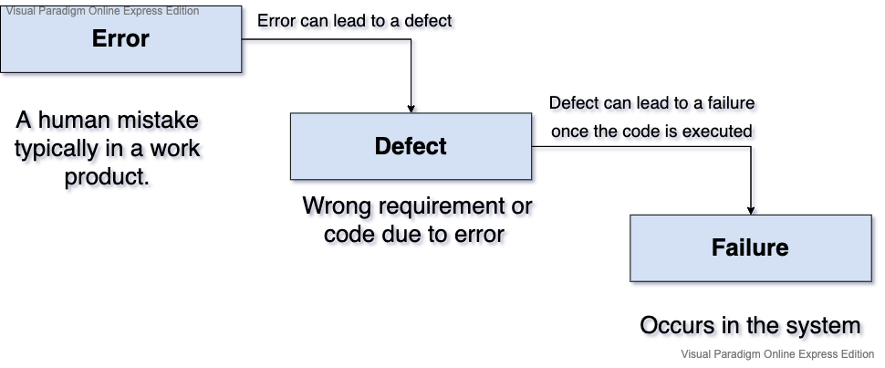

## 1.2.1 **Testing's contributions to success**

___
## 1.2.2 **Quality Assurance and Testing**

### **Quality Management**
- [x] All activities that direct and control quality in organization.
### **Quality Assurance**

- [x] Adherence to proper process.
### **Quality Control**

- [x] Includes testing and other activities to achieve quality.
___
## 1.2.3 **'Errors', 'defects' and 'failures'**

Software systems are increasingly complex, often systems are connected to many other systems.

Development of these complex systems requires a great deal of time, skill and effort, and during this process, human beings can make **errors** or **mistakes**.

**Errors** can lead to the introduction of a defect *(fault or bug)* in the software code or in any other work product.

Errors may occur due to many reasons such as: 

- [x] Time pressure.
- [x] Humans are not perfect, so always there is a risk to make errors or mistakes.
- [x] Skills not match with the architecture or technologies 
- [x] Complexity of system
- [x] Changing technologies

If a **Defect** has been introduced into the code after the code is executed it could cause a **failure**.
*(A failure occurs within the system).*

Failures may also caused by environmental conditions

### **Diagram:**

___
## 1.2.4 **Defects Root Causes and Effects**

The root causes of defects are the earliest actions or conditions that contributed to creating the defects.
Typical RCA include:
 
- [x] Unclear requirement
- [x] Missing requirement
- [x] Wrong requirement
- [x] Code logic error
- [x] Invalid data