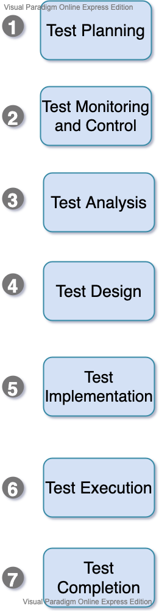

(ISO /IEC/IEEE 29119 -2) provides more information about test processes.

## **Considerations**

Contextual factor that influence the test process for an organization include, but not are limited to:

- [x] SDLC model and project methodologies being used.
- [x] Test levels and test types  being considered.
- [x] Product and project risks
- [x] Business domain
- [x] Operational constraints:
    - Budget and resources
    - Timescales
- [x] Complexity
- [x] Organizational policies and standards 
- [x] Regulatory contracts 
___
### **Test activities and tasks**

