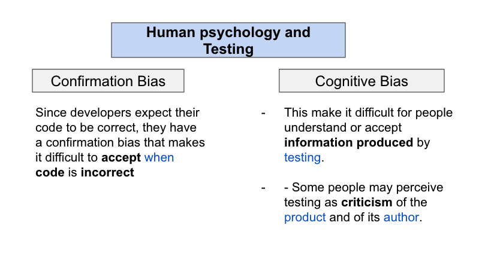
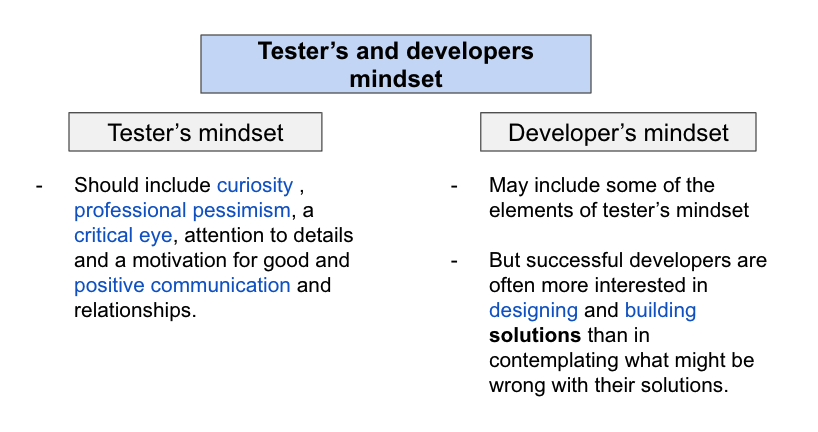

## 1.5.1 **Human Psychology and Testing**

### **Constructive way:**

  **Testers** and **managers** need to have good **interpersonal skills** to be able to communicate effectively about defects, failures, test results, test progress and risks. 

- [x] Start with collaboration rather than battles.

- [x] Emphasize the benefits of testing. 

- [x] Communicate test results and other findings in a neutral way. 

- [x] Try to understand how the other person feels. 

___
## 1.2.1 **Tester's and Developer's mindset**

### **Independent Testers:**

Bring a perspective that is different thant the one of its product authors *(i.e business analysts, product owners, designers and programmers)*