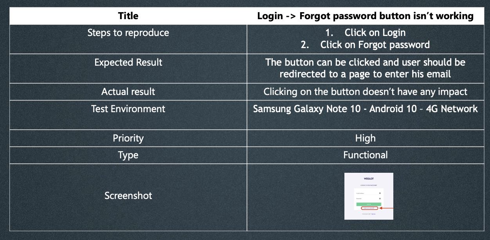

## **What is a defect report?**

Documentation of the occurrence, nature, and status of a **defect**.

If we use an example like Facebook, these would be the priorities.
___
### **Bug priority:**

* **Critical:** 

Login isn’t working-Application crashes in Home page – Wrong cart value

* **High:** 

Login page responds slowly – User is not able to add profile image

* **Medium:** 

Some pages have poor performance- Portrait mode isn’t working correctly

* **Low:** 

Spelling mistakes – Image misalignment

___

### **Example of a defect report:**

