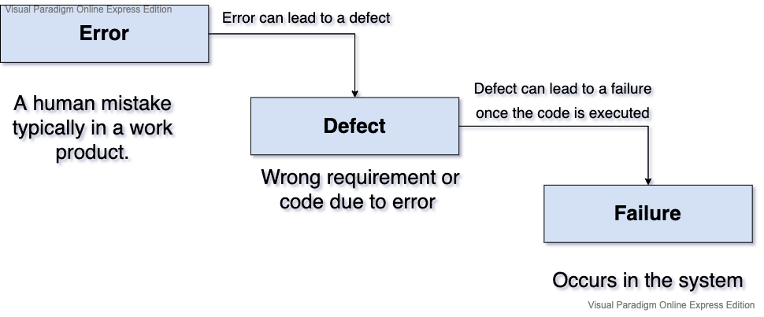

## **Definition of 'testing':**

*"Software testing is a way to asses the quality of the software and to reduce the risk of software failures in operation."*

!!!note
    ISTQB definition:
    *"Testing is the process consisting of all lifecycle activities (static and dynamic) concerned with planning preparation and evaluation pf a component system and related work products to determine that they satisfy specified requirements for purpose and to detect defects."*

A common misconception of testing is that it only consists of running tests, executing the software and checking the results.
However, test activities are before and after test execution. 

**Example:**

* Planning and control
* Choose test conditions
* Designing test cases
* Evaluation of completion criteria 
* Reporting the testing progress and results
___

## **Typical testing objectives**

- [x] Verify requirements
- [x] Prevent defects
- [x] Find defects and failures
- [x] Gain confidence in system
- [x] Reduce the level of risk
- [x] Providing information for decision making
- [x] Compliance
___

## **'Errors', 'defects' and 'failures'**

Software systems are increasingly complex, often systems are connected to many other systems.

Development of these complex systems requires a great deal of time, skill and effort, and during this process, human beings can make **errors** or **mistakes**.

**Errors** can lead to the introduction of a defect *(fault or bug)* in the software code or in any other work product.

Errors may occur due to many reasons such as: 

* Time pressure.
* Humans are not perfect, so always there is a risk to make errors or mistakes.
* Skills not match with the architecture or technologies 
* Complexity of system
* Changing technologies

If a **Defect** has been introduced into the code after the code is executed it could cause a **failure**.
*(A failure occurs within the system).*

Failures may also caused by environmental conditions

### **Diagram:**

gst
___

## **Root Cause Analysis**

The root causes of defects are the earliest actions or conditions that contributed to creating the defects.
Typical RCA include:
 
* Unclear requirement
* Missing requirement
* Wrong requirement
* Code logic error
* Invalid data

