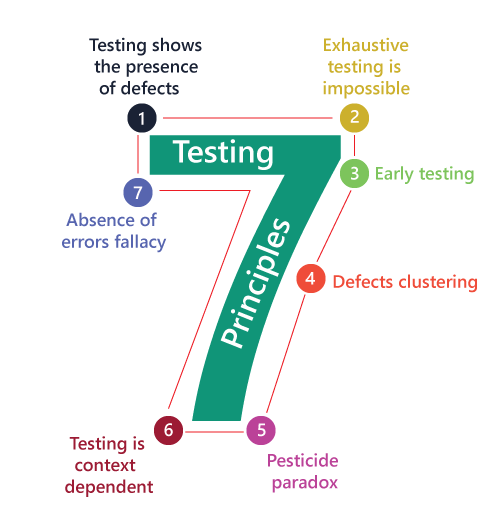
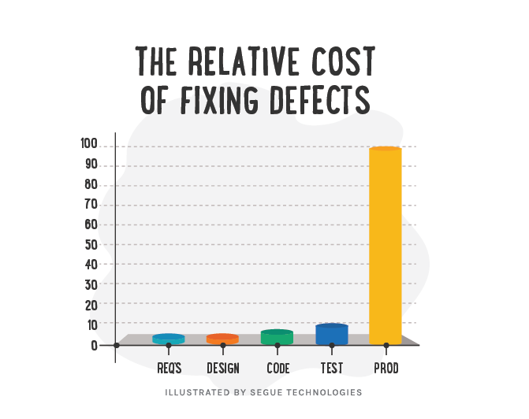

Over the last 50 years, there have been number of testing principles that offer general guidelines but the ISTQB Syllabus covers 7 principles:
___

## **Principle 1:** Testing shows presence of defects, not their absence.

Testing can show that defects are present, but it cannot prove that no defects are remaining.

!!!note
    Even when no defects are found during testing, it can´t be proved that software is defect-free. Always exist risks.

___
## **Principle 2:** Exhaustive testing is impossible

Testing everything (all combinations of inputs and preconditions) is not possible, except for trivial cases.

Rather than attempting to test exhaustively, the effort should be focus on risks analysis, test techniques and priorities.

!!!note
    * It is not possible to test all possible combinations of data input in most of the circunstances.
    * Exhaustive testing is a test approach in which all possible data combinations are used, including the implicit in the state of the software, so is not feasible.
___
## **Principle 3:** Early testing saves time and money

The following diagram shows that the relative cost of fixing the defects increase with each project phase.

___
## **Principle 4:** Defects cluster together

Experience shows that in general, a small number of software modules contains most of the defects discovered during *pre-release* testing or are responsible for most of the operational failures.

**Defects are clustered in modules that are:**

* More complex
* Larger
* More prone to changes
* Have been worked on by many different developers over time

!!!note
    * 80% of defects come from 20% of the modules (Pareto principle applied to software testing).
___
## **Principle 5:** Beware of Pesticide paradox

If the same tests are repeated over and over again, eventually these tests no longer find any new defects.

If the same test cases fail to find any new defects, running the same test cases, again and again, will eventually leave the tester with a false sense of security.(The same apply for regression tests)

**Recommendations:**

* Review test cases regularly
* Add more relevant new test cases to exercise different parts of the software and remove the test cases which are not required.
* Consider the value of running tests in each regression run. 
Make sure there is a *value-add* from the effort. 

___
## **Principle 6:** Testing is context dependent

Testing is done differently in different contexts. For example, safety-critical software is tested differently from e-commerce software.

**Recommendations:**

* Same set of testing activities are not applicable for all applications.
* Testing is done for different applications.
* Risk must be considered in determining the type of testing that is needed.
___

## **Principle 7:** Absense-of-error fallacy

It is a mistake to expect that just finding and fixing a large number of defects will ensure the success of a system.
