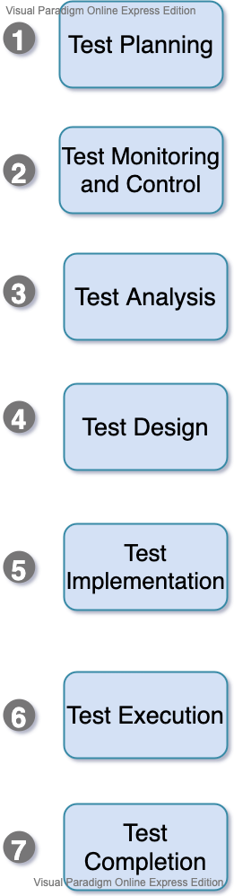

(ISO /IEC/IEEE 29119 -2) provides more information about test processes.

## **Considerations**

Contextual factor that influence the test process for an organization include, but not are limited to:

* SDLC model and project methodologies being used.
* Test levels and test types  being considered.
* Product and project risks
* Business domain
* Operational constraints:
    * Budget and resources
    * Timescales
*    * Complexity
* Organizational policies and standards 
* Regulatory contracts 
___
### **Test activities and tasks**

