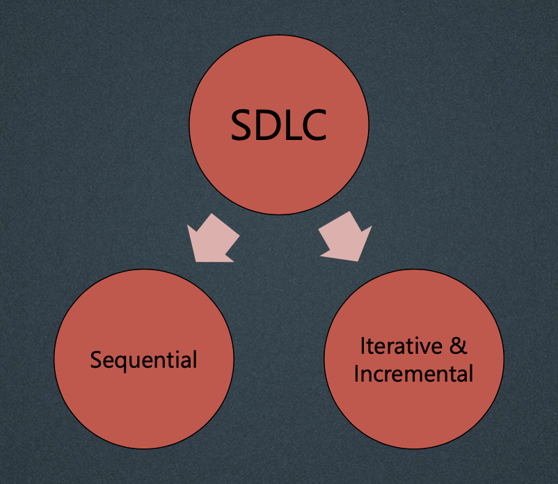
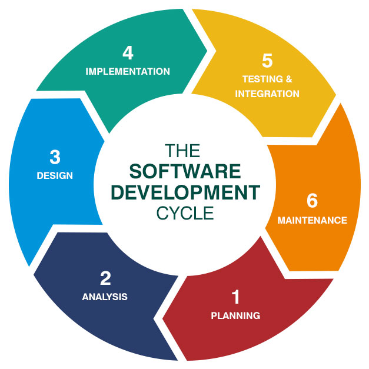
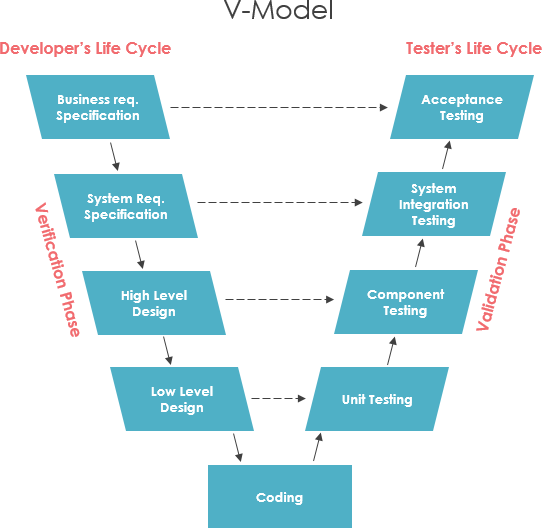
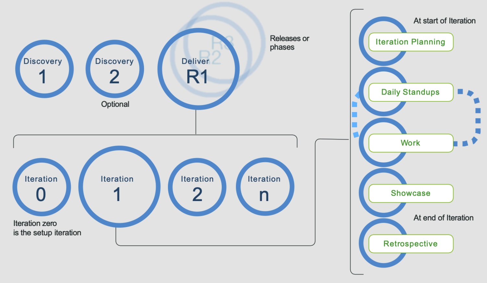

## **Software Development Life Cycle (SDLC**

A SDLC describes the type of activities performed at each stage in a software development project.

There are a number of different software development lifecycle models, each of which requires different approaches to testing.

___

## **Software Development Process Models.**

ISTQB Syllabus divide the models into 3 categories:

**1.- Traditional** *(optional, and default for Project management)*

**2.- Sequential** 

**3.- Iterative and Incremental**

### **Traditional SDLC**

The traditional SDLC is a model used in project management that defines the stages include in an information system development project, from an initial feasibility study to the maintenance of the completed application.

### **Sequential Development model**

This model describes the software development process as a linear, sequential flow of activities.

That means that any phase in the development process should only begin when the previous phase is completed.

**Examples:**

* **Waterfall model**

* **V-model**

**Explanation:**

The activities on the left-hand side of the V-model focuses on work-product creation for elaborating the initial requirements and then providing more technical detail for the development. (*Static testing*)

The activities for the right-hand focuses on the testing activities. (*Dynamic testing*)

* **Verification** helps to ensure that the product is built in the right way.(*the process*)

* **Validation** checks that the right product is being built.

___

### **Iterative and incremental model**

Works on smaller incremental developments. (*iterations*)

___
## **Good practices for Software Development and Software Testing:**

* [x] For every development activity, there is a corresponding testing activity.
* [x] Each test level has test objectives specific to that level
* [x] The analysis and design of tests for a given test level should begin during the corresponding development activity.
* [x] Testers participate in discussions to define and refine requirements and design.

___

