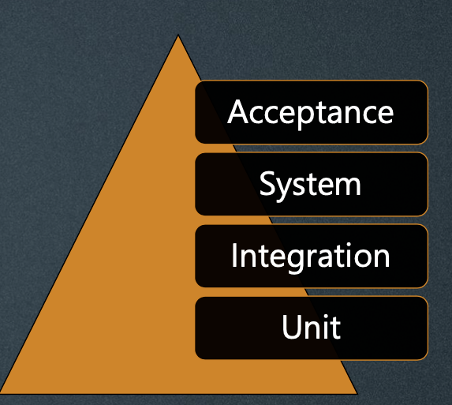
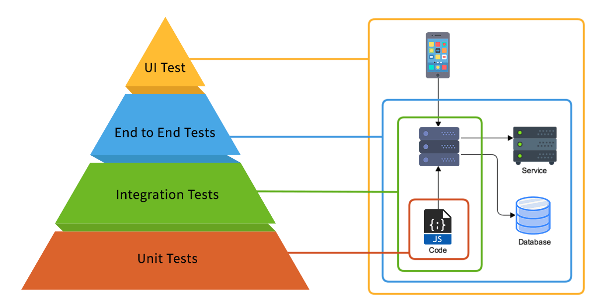

For every test level, a suitable test environment is required, for example for Acceptance is Production and for Unit tests is the development environment.

___
## **Unit/component testing**

Focuses on components that are separately testable.

### **Typical test basis**

* Detailed design
* Code
* Data model
* Component specification

### **Typical defects and failures:**

* Incorrect functionality
* Data flow problems
* Incorrect code and logic

### **Typical test objects:**

* [x] Components, units or modules
* [x] Code and data structures
* [x] Classes
* [x] Database modules

### **Summary:**

* Performed by developers who have coded the component.
* For agile teams, Test Driven Development (TDD) is the most common practice.
* Developed and tested using development environment.

___
## **Integration testing**

Focuses on the interaction between components or systems.

This stage should be focuses on the communication between the modules, not the functionality of the individual modules because that part should be covered in unit tests. 

### **Typical test basis**

* Architecture at component or system level
* Sequence diagrams
* Interface and communication protocol specifications
* Use cases
* Workflows

### **Typical defects**

* Interfaces mismatch
* Failures in communication between components
* Incorrect timing, sequencing or interface calls

### **Typical test objects**

* [x] Sub-systems
* [x] Database implementation
* [x] Infrastructure
* [x] Interfaces
* [x] API´s
* [x] Microservices
___
## **System testing**

### **Typical test basis**

* Use cases
* Epics and user stories
* Models of system behavior
* State diagrams
* System and user manuals

### **Typical defects**

* Incorrect calculations
* Incorrect or unexpected system functional or non-functional behavior
* Failure of the system to work properly
* Failure of the system to work as described in system and user manual

### **Typical test objects**

* [x] Applications
* [x] Hardware/Software systems
* [x] O.S
* [x] System Under Test (SUT)

___
## **Acceptance testing**

Then purpose of acceptance testing is to validate the system is fit for purpose.

### **Typical test basis**

* Business processes 
* User or business requirements
* Risk analysis reports
* Installation procedures
* Legal contracts or standards

### **Typical defects**

* System workflows don´t meet business or user requirements
* Business rules are not implemented correctly
* Non-functional failures such as security vulnerabilities, performance efficiency or improper operations.

### **Typical test objects**

* [x] System Under Test
* [x] Forms
* [x] Reports
* [x] Recovery systems and hot sites
* [x] Existing and converted production data

### **Alpha and Beta testing:**

**Alpha**

Is performed at the developing organization´s site, not by the development team, but by potencial or existing customer, operators or independent test team.

**Beta**

Is performed by potential or existingn customer or operators at their own locations.

!!!note
    Beta testing may come after Alpha testing or may occur without any preceding alpha testing.
___