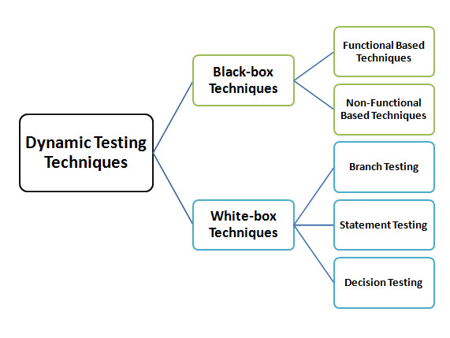

*Is the type of testing that validates the functionality of an application when the code is executed*
___

## **Main features**

* Dynamic testing involves both functional and non-functional testing.
* It is executed during the **validation** stage of the software testing.
* Is done by executing the code.

___
## **Dynamic Testing Techniques:**

### **Functional Testing:**

* **Unit Testing**
* **Integration Testing**
* **System Testing**

### **Non-functional Testing:**

* **Security testing**
* **Performance testing**
* **Recovery testing**

