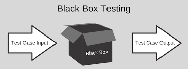
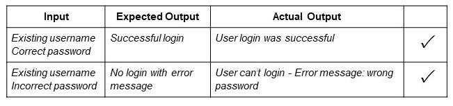

Testing without knowing the internal structure of the system.

## **Types of Black box testing**

Black box testing can be applied to three main types of tests: 
*functional*, *non-functional*, and *regression testing*.

### **Functional testing**

It can check if it´s possible log in using correct credentials or not if are wrong.

### **Non functional testing**

* It can check for security vulnerabilities.
* Performance under expected loads
* Usable and easy to understand for users
* Compatible with relevant devices, screen sizes, browsers or O.S.

### **Regression testing**

Regression can be applied for functional and non-functional. 

Black box can check if a new version of software load slower as an example.

___

### **Black Box testing techniques:**

* Equivalence Partitioning
* Boundary Value Analysis
* Decision Table Testing
* Error guessing