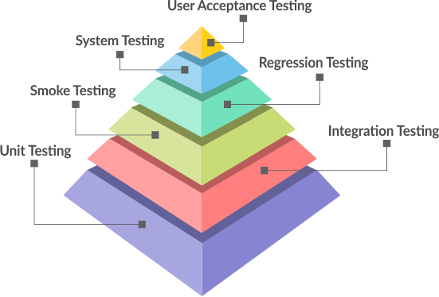
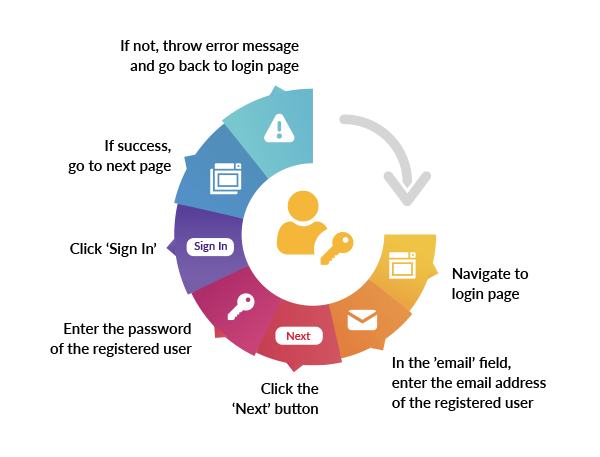

Is conducted to verify that functions of a system are working as specified. 

There are a variety of functional testing strategies, and the best way to ensure functional test coverage is a mix of **manual** and **automated** testing.

The most common functional testing strategies are black-box testing methods wherein the tester does not need to review the internal source code, but validates functionality by testing various input combinations.
___
## **Main features**

- Testing what the system should do
- Usually answered with (Yes/No)
- Functional tests should be performed at all test levels
- Can run manual and automated tests
___

____

## **Login example**

* Navigate to login page
* In the ’email’ field, enter the email address of the registered user
* Click the ‘Next’ button
* Enter the password of the registered * user
* Click ‘Sign In’
* If success, go to next page
* If not, throw error message and go back to login page

___

## **Tools**

* **Selenium**

* **Cypress**

* **MicroFocus**

* **Katalon**
