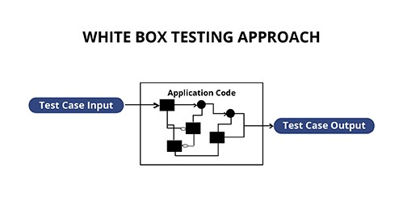

is a method of software testing that tests internal structures or workings of an application

is a method of software testing that tests internal structures or workings of an application

___
## **Types of White Box Testing**
White box testing can take several forms:

* **Unit testing** — test the code that each component is working as expected.
* **Mutation testing** — a type of unit testing that checks the robustness and consistency of the code by defining tests, making small, random changes to the code and seeing if the tests still pass.
* **Integration testing** — tests specifically designed to check integration points between internal components in a software system, or integrations with external systems.
* **White box penetration testing** — an ethical hacker acts as a knowledgeable insider, attempting to attack an application based on intimate knowledge of its code and environment.
* **Static code analysis** — automatically identifying vulnerabilities or coding errors in static code, using predefined patterns or machine learning analysis.

