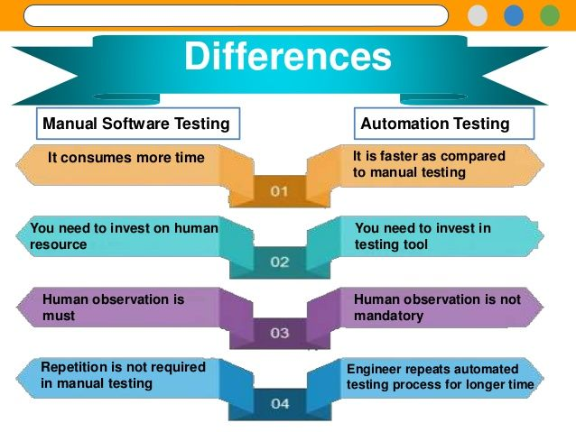

___

## **Scenarios**

### **Manual Testing Scenarios**

* **Exploratory Testing**

This type of testing requires the tester’s domain expertise, logical and creative thinking, past knowledge and experience.

In this scenario, human skills are required to execute the testing process.

* **Usability Testing**

In this testing manual approach is preferred as we need to evaluate how user-friendly, efficient and easy-to-use the application is from an *end-user’s perspective*.

* **Ad-hoc Testing**

It is a totally unplanned method of testing where the understanding and insight of the tester is the only important factor.

### **Test Automation Scenarios**

* **Regression Testing**

Here, automated testing is suitable because of the frequent code changes and the ability to run the regressions in a timely manner.

* **Load Testing**

Automated testing is also the best way to complete the testing efficiently when it comes to load testing.

* **Performance Testing**

Testing which requires the simulation of thousands of concurrent users requires automation. This involves load, stress,volume etc.