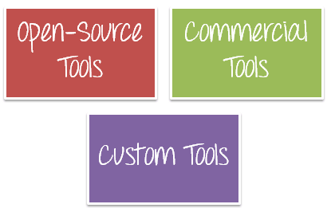

## **Type of testing tools:**

#### **Open-source:**

* Appium 
* Selenium 
* Capybara
* testNG
* Katalon Studio
* Cypress
* testNG
* Jmeter

### **Commercial tools**

* IBM Rational Functional Tester (RFT)
* Automation Anywhere

### **Custom tools**

The framework you create.