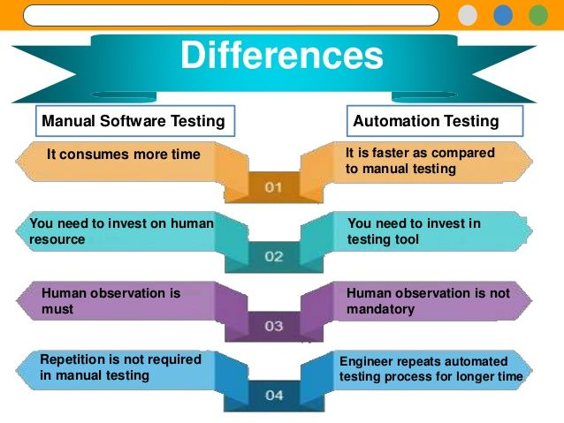

## **Considerations**

According to test experts, these are the things you need to consider when choosing your tools: 

* **1.-** Does your team possess the necessary skills to best utilize the tool?

* **2.-** What is your team budget?

* **3.-** What features to look for?
    * Supported platforms
    * Programming languages
    * CI/CD integration capabilities
    * Reporting functionality
    * Complexity
    * Cross-browser testing

* **4.-** How difficult is script maintenance and reusability?

* **5.-** How are the integration capabilities

* **6.-** How and where can you get technical support?

