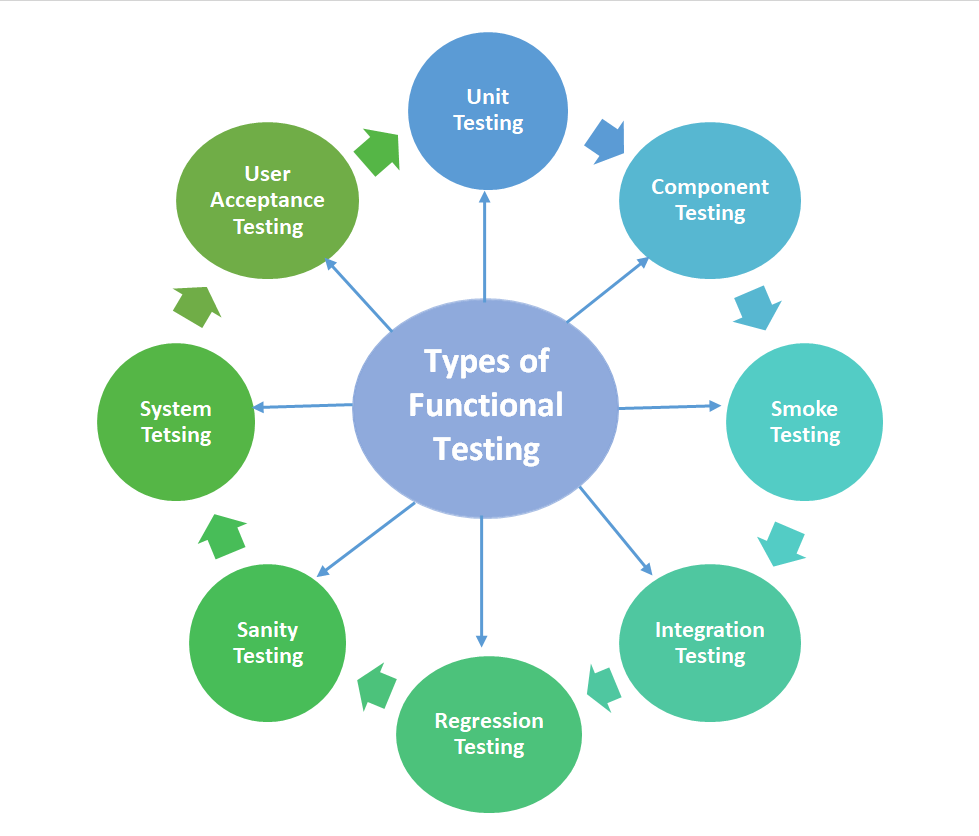
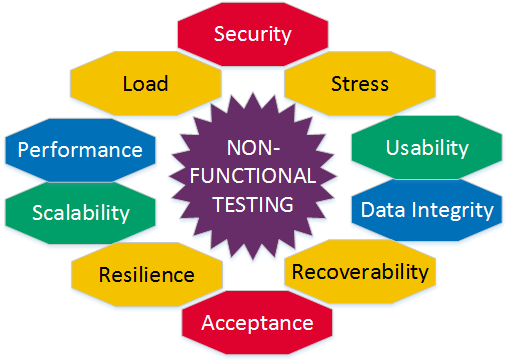
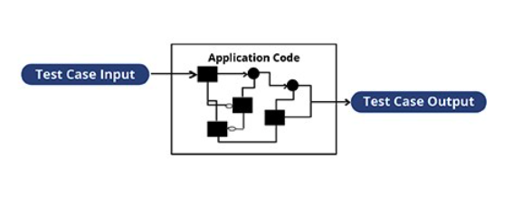
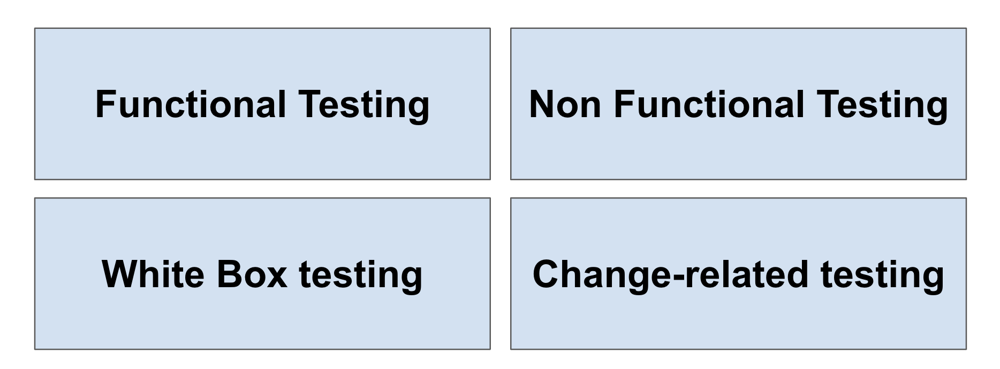

## 2.3.1 - **Functional Testing**

* Functional testing of a system involves tests that evaluate functions that the system should perform.
Functional requirements may be described in work products such as business requirements
specifications, epics, user stories, use cases, or functional specifications, or they may be undocumented.
The functions are “what” the system should do.

* Functional tests should be performed at all test levels (e.g., tests for components may be based on a
component specification), though the focus is different at each level
___

## 2.3.2 - **Non-functional Testing**

* Non-functional testing of a system evaluates characteristics of systems and software such as usability, performance efficiency or security

* For a classification of software product quality characteristics. Non-functional testing is the testing of “how well” the system behaves.

* Contrary to common misperceptions, non-functional testing can and often should be performed at all test
levels, and done as early as possible

* Black-box techniques (see section 4.2) may be used to derive test conditions and test cases for nonfunctional testing.

___
## 2.3.3 - **White Box Testing**

* White-box testing derives tests based on the system’s internal structure or implementation. Internal
structure may include code, architecture, work flows, and/or data flows within the system.

* White-box test design and execution may involve special skills or knowledge, such as the way the code is built, how data is stored (e.g., to evaluate possible database queries), and how to use coverage tools and to correctly interpret their results.
____
## 2.3.4 - **Change-related Testing**

**Confirmation Testing:**

re-execute test cases that failed, to ensure that defect has been fixed.

**Regression testing:**

Confirm that recent changes have not introduced defects to existing functionalities.

___

## 2.3.5 - **Test Types and Test Levels**

**Test types:**

**Test levels:**

