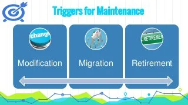

### **Introduction:**

Once deployed to production environments, software and systems need to be maintained. Changes of
various sorts are almost inevitable in delivered software and systems, either to fix defects discovered in operational use, to add new functionality, or to delete or alter already-delivered functionality.

- Maintenance can involve planned releases and unplanned releases (hot fixes). 

A maintenance release may require maintenance testing at multiple test levels, using various test types,
based on its scope. The scope of maintenance testing depends on:

- [x] The degree of risk of the change, for example, the degree to which the changed area of software
communicates with other components or systems
- [x] The size of the existing system
- [x] The size of the change

## 2.4.1 - **Triggers and Maintenance**

**We can classify the triggers for maintenance as follows:** 

- **Modification**, such as planned enhancements (e.g., release-based), corrective and emergency
changes, changes of the operational environment (such as planned operating system or database upgrades), upgrades of COTS software, and patches for defects and vulnerabilities

- **Migration**
    such as from one platform to another, which can require operational tests of the new environment.

    - **Retirement**, such as when an application reaches the end of its life,

    - **Testing restore/retrieve** procedures after archiving for long retention periods may also be needed.

    - **Regression** testing may be needed to ensure that any functionality that remains in service still works.
___

## 2.4.2 - **Impact Analysis and Maintenance**

* Impact analysis evaluates the changes that were made for a maintenance release to identify the intended
consequences as well as expected and possible side effects of a change, and to identify the areas in the
system that will be affected by the change.

* Impact analysis may be done before a change is made, to help decide if the change should be made,
based on the potential consequences in other areas of the system.

**Impact analysis can be difficult if:**

- [X] Specifications (e.g., business requirements, user stories, architecture) are out of date or missing
- [X] Test cases are not documented or are out of date
- [X] Bi-directional traceability between tests and the test basis has not been maintained
- [X] Tool support is weak or non-existent
- [X] The people involved do not have domain and/or system knowledge
- [X] Insufficient attention has been paid to the software's maintainability during development