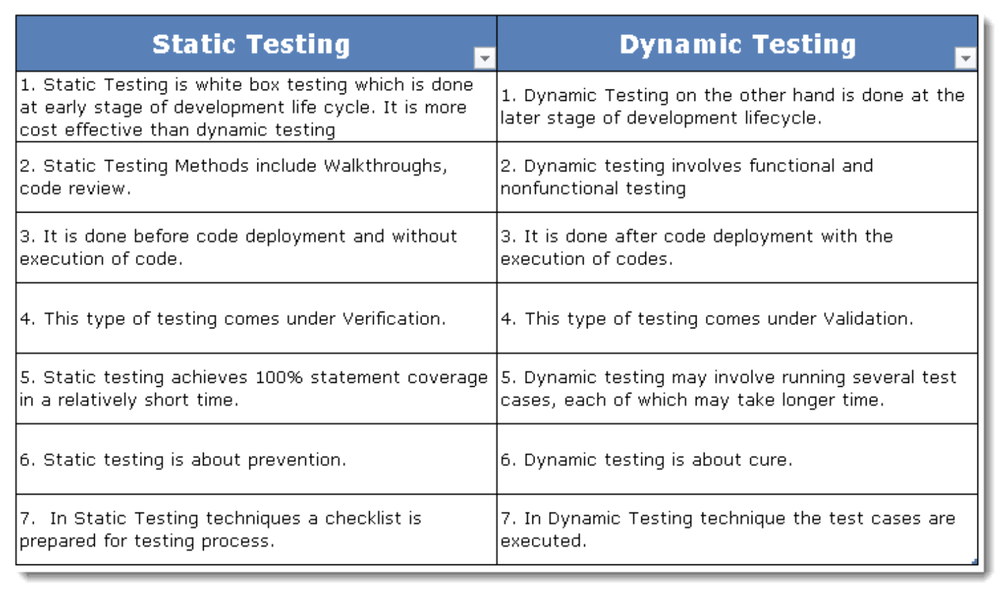

## 3.1.1 - **Work Products that can be examined by Static Testing**

___

## 3.1.2 - **Benefits of Static Testing**

- When applied **early** in the software development
lifecycle, enables the early detection of defects before dynamic testing is performed, examples:
    - in requirements
    - design specifications reviews
    - backlog refinement, etc.

- Defects found **early** **are** often much **cheaper** to remove **than** defects found **later** in the lifecycle, especially when the software is deployed and in active use.

### **Additional benefits of static testing may include:**

- [x] Detecting and correcting defects more efficiently, and prior to dynamic test execution
- [x] Identifying defects which are not easily found by dynamic testing
- [x] Preventing defects in design or coding by uncovering inconsistencies, ambiguities, contradictions,
omissions, inaccuracies, and redundancies in requirements
- [x] Increasing development productivity (e.g., due to improved design, more maintainable code)
- [x] Reducing development cost and time
- [x] Reducing testing cost and time
- [x] Reducing total cost of quality over the software’s lifetime, due to fewer failures later in the
lifecycle or after delivery into operation
- [x] Improving communication between team members in the course of participating in reviews

___

## 3.1.3 - **Differences between Static and Dynamic Testing**

___