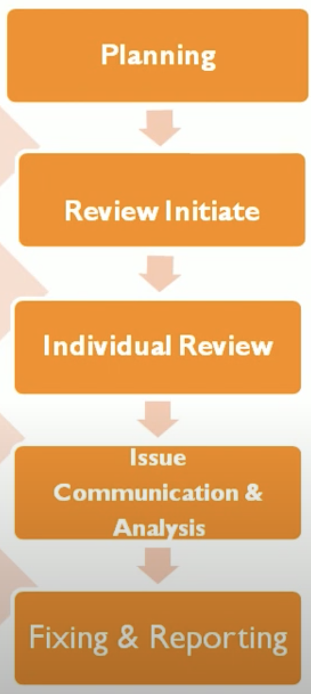
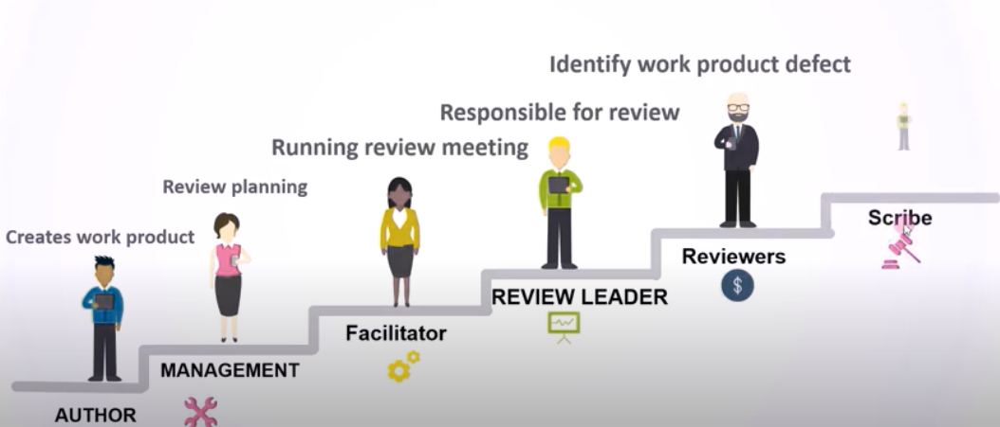
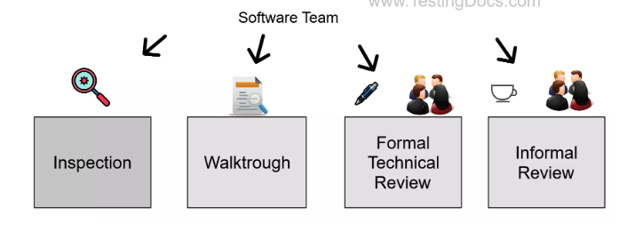
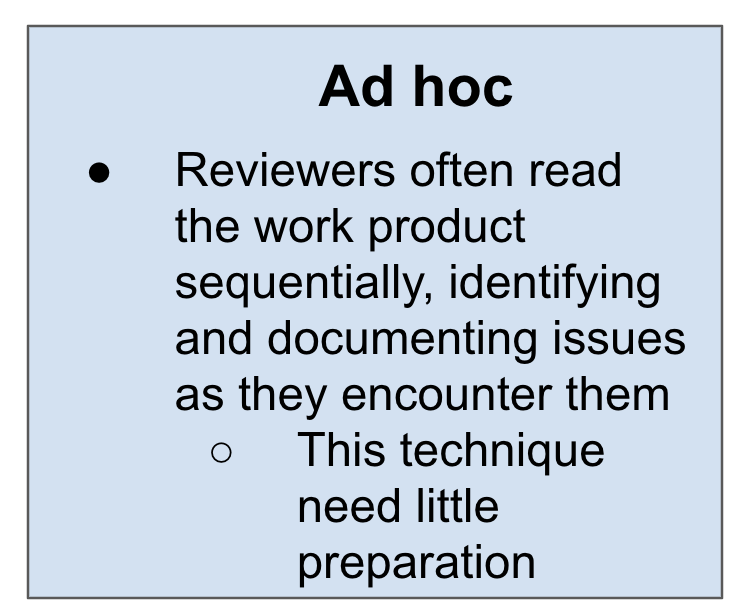
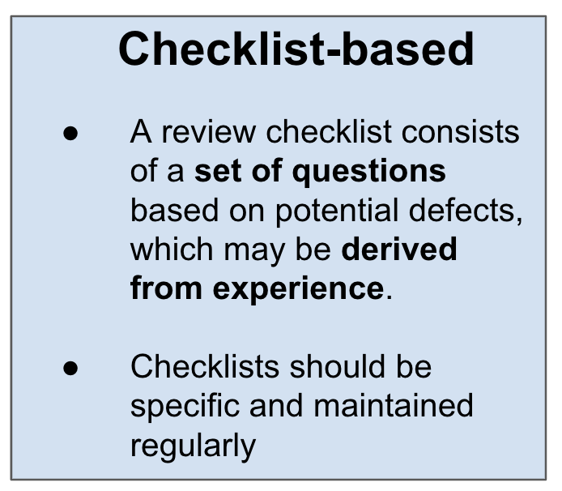
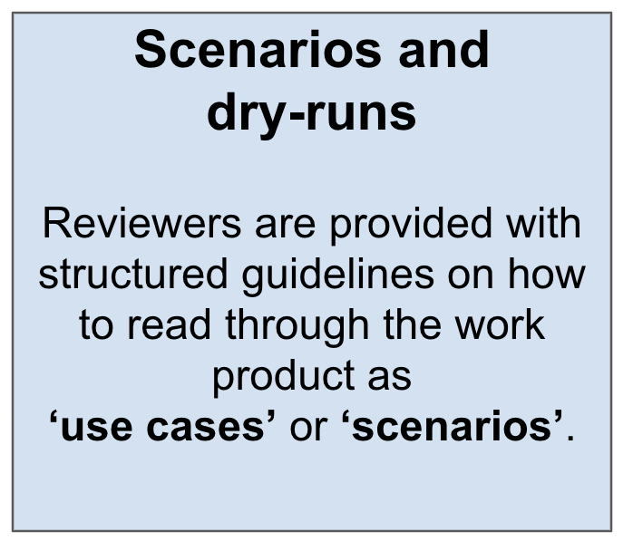
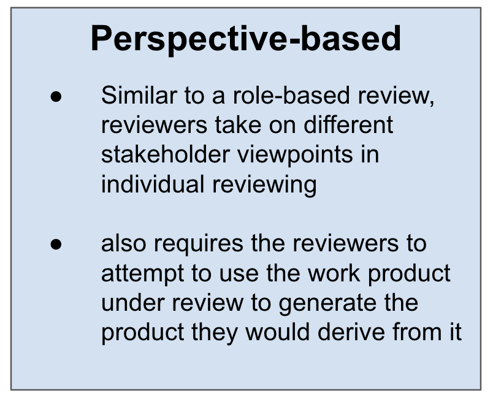
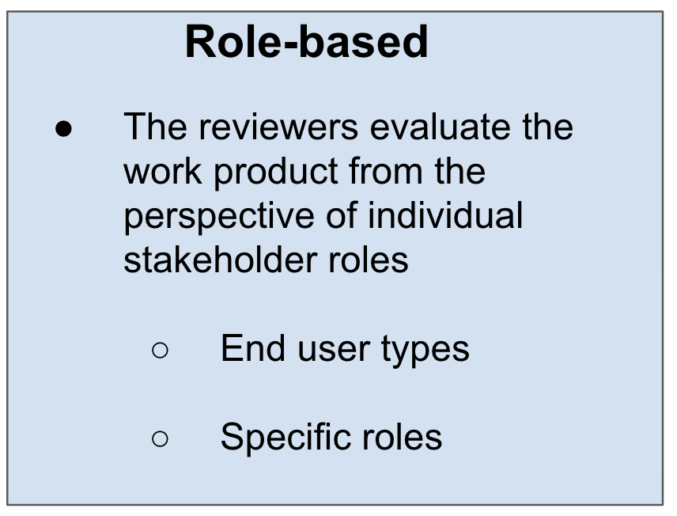

## 3.2.1 - **Work Product Review Process**

The review process comprises the following main activities:

- ### **Planning**
  
    - [x] Defining the scope, which includes the purpose of the review, what documents or parts of
documents to review, and the quality characteristics to be evaluated
    - [x] Estimating effort and timeframe
    - [x] Identifying review characteristics such as the review type with roles, activities, and checklists
    - [x] Selecting the people to participate in the review and allocating roles
    - [x] Defining the entry and exit criteria for more formal review types (e.g., inspections)
    - [x] Checking that entry criteria are met (for more formal review types)

- ### **Initiate review**
  
      - [x] Distributing the work product (physically or by electronic means) and other material, such as
issue log forms, checklists, and related work products
      - [x] Explaining the scope, objectives, process, roles, and work products to the participants
      - [x] Answering any questions that participants may have about the review
  
- ### **Individual review (i.e., individual preparation)**

      - [x] Reviewing all or part of the work product
      - [x] Noting potential defects, recommendations, and questions
  
- ### **Issue communication and analysis**

    - [x] Communicating identified potential defects (e.g., in a review meeting)
        - [x] Analyzing potential defects, assigning ownership and status to them
        - [x] Evaluating and documenting quality characteristics
        - [x] Evaluating the review findings against the exit criteria to make a review decision (reject; major changes needed.

- ### **Fixing and reporting**
  
    - [x] Creating defect reports for those findings that require changes to a work product
    - [x] Fixing defects found (typically done by the author) in the work product reviewed
    - [x] Communicating defects to the appropriate person or team (when found in a work product related
to the work product reviewed)
    - [x] Recording updated status of defects (in formal reviews), potentially including the agreement of
the comment originator
    - [x] Gathering metrics (for more formal review types)
___

## 3.2.2 - **Roles and Responsibilities in a formal review**

___

## 3.2.3 - **Review Types**

___

## 3.2.4 - **Applying Review Techniques**

___

## 3.2.5 - **Success Factors for Reviews**

Each review has clear objectives, defined during review planning, and used as measurable exit
criteria

- [x] Review types are applied which are suitable to achieve the objectives and are appropriate to the
type and level of software work products and participants
- [x] Any review techniques used, such as checklist-based or role-based reviewing, are suitable for
effective defect identification in the work product to be reviewed
- [x] Any checklists used address the main risks and are up to date
- [x] Large documents are written and reviewed in small chunks, so that quality control is exercised by
providing authors early and frequent feedback on defects
- [x] Participants have adequate time to prepare
- [x] Reviews are scheduled with adequate notice