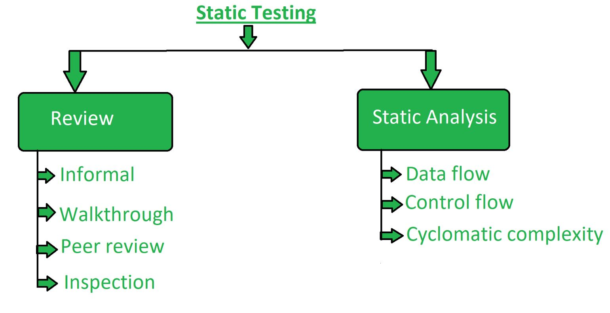

*Is a software testing method that involves examination of program´s code and its associated documentation but does not require the program to be executed.*
___

## **Main features**

* It is a stage of **white box** testing.
* Can also be referred as **dry-run** testing.
* Is performed during the **verification** process.

___
## **Static Testing Techniques:**

Can be used to 'test' any form of document including *source code*, *design documents* and *models*, *functional specifications* and *requirements*.

### **Review:**

Typically used to find and eliminate errors or ambiguities in documents such as requirements, design, test cases, etc.

### **Static analysis:**

The code written by developers are analysed (usually by tools) for structural defects that may lead to defects.
___
## **Tools**

* Raxis
* RIPS Technologies
* Code Compare
