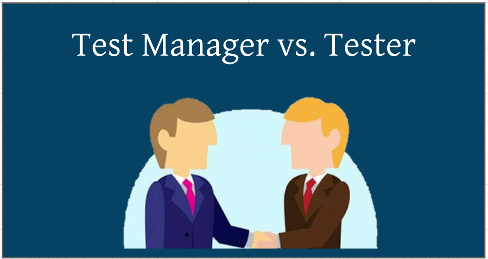
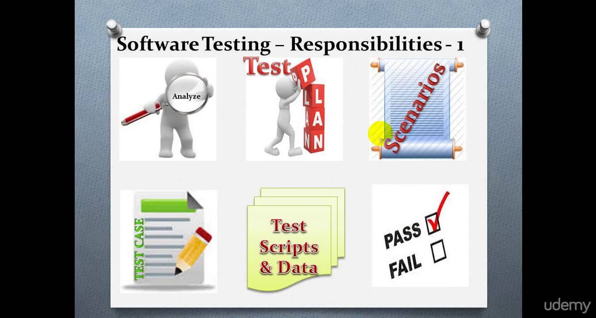

# 5.1 - **Test Organization**
___
## 5.1.1 - **Independent Testing**

* Testing tasks may be done by people in a specific testing role, or by people in another role (e.g.,
customers). A certain degree of independence often makes the tester more effective at finding defects
due to differences between the author’s and the tester’s cognitive biases.

* For most types of projects, it is usually best to have multiple test levels, with some of these levels handled
by independent testers. Developers should participate in testing, especially at the lower levels, so as to
exercise control over the quality of their own work. 

**Degrees of independence in testing include the following (from low level of independence to high level):**

- [x] No independent testers; the only form of testing available is developers testing their own code
- [x] Independent developers or testers within the development teams or the project team; this could
be developers testing their colleagues’ products
- [x] Independent test team or group within the organization, reporting to project management or
executive management
- [x] Independent testers from the business organization or user community, or with specializations in
specific test types such as usability, security, performance, regulatory/compliance, or portability
- [x] Independent testers external to the organization, either working on-site (in-house) or off-site
(outsourcing)

The way in which independence of testing is implemented varies depending on the software development
lifecycle model. 
___
___
## 5.1.2 - **Tasks of the Test Manager and Tester**

### **Test Manager**

The test manager is tasked with overall responsibility for the test process and successful leadership of the
test activities. The test management role might be performed by a professional test manager, or by a
project manager, a development manager, or a quality assurance manager.

**Typical test manager tasks may include:**

- [x] Write and update the test plan(s)
- [x] Coordinate the test plan(s) with project managers, product owners, and others
- [x] Share testing perspectives with other project activities, such as integration planning\
- [x] Prepare and deliver test progress reports and test summary reports based on the information
gathered
- [x] Support setting up the defect management system and adequate configuration management of
testware 
- [x] Decide about the implementation of test environment(s)
- [x] Promote and advocate the testers, the test team, and the test profession within the organization

### **Tester**

The role is oriented mostly for tasks which involve some analysis, execution and reporting of test cases, scenarios and test suites.

**Typical tester tasks may include:**

- [x] Design and implement test cases and test procedures
- [x] Prepare and acquire test data
- [x] Create the detailed test execution schedule
- [x] Use appropriate tools to facilitate the test process 
- [x] Automate tests as needed
- [x] Review tests developed by others