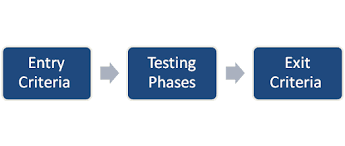

## 5.2.1 - **Purpose and content of a Test Plan**

A test plan outlines test activities for development and maintenance projects. Planning is influenced by the test policy and test strategy of the organization, the development lifecycles and methods being used, the scope of testing, objectives, risks, constraints, criticality, testability, and the availability of resources.

**Test planning activities may include the following and some of these may be documented in a test plan:**

- [x] Determining the scope, objectives, and risks of testing 
- [x] Defining the overall approach of testing
- [x] Budgeting for the test activities
- [x] Selecting metrics for test monitoring and control
- [x] Scheduling
## 5.2.2 - **Test Strategy and Test Approach**

- Analytical.

- Model-Based

- Methodical

- Process-compliant

- Directed

- Regression-averse

- Reactive

___
___
## 5.2.3 - **Entry Criteria and Exit Criteria (DoR & DoD)**

Entry and exit criteria should be defined for each test level and test type, and will
differ based on the test objectives.

### **Typical entry criteria include:** 

- [x] Availability of testable requirements, user stories, and/or models (e.g., when following a modelbased testing strategy)
- [x] Availability of test items that have met the exit criteria for any prior test levels
- [x] Availability of test environment
- [x] Availability of necessary test tools
- [x] Availability of test data and other necessary resources

### **Typical exit criteria include:** 

- [x] Planned tests have been executed
- [x] A defined level of coverage (e.g., of requirements, user stories, acceptance criteria, risks, code)
has been achieved
- [x] The number of unresolved defects is within an agreed limit
- [x] The number of estimated remaining defects is sufficiently low
___
___
## 5.2.4 - **Test Execution Schedule**

- Ideally, test cases would be ordered to run based on their priority levels, usually by executing the test
cases with the highest priority first. However, this practice may not work if the test cases have
dependencies or the features being tested have dependencies.

- The test execution schedule should take into account
such factors as prioritization, dependencies, confirmation tests, regression tests, and the most efficient
sequence for executing the tests.

- In some cases, various sequences of tests are possible, with differing levels of efficiency associated with
those sequences. In such cases, trade-offs between efficiency of test execution versus adherence to
prioritization must be made.

___
___
## 5.2.5 - **Factors Influencing the Test Effort**

**Product characteristics**

- The complexity of the product domain
- The required level of detail for test documentation
- The risks associated with the product
- The quality of the test basis
- The size of the product

**Development process characteristics**

- The development model in use
- The test approach
- The tools used
- The test process
- Time pressure

**People characteristics**

- Skills and experience 
- Team cohesion and leadership

**Test results**

- The number and severity of defects found
- The amount of rework required

___
___
## 5.2.6 - **Test Estimation Techniques**

There are a number of estimation techniques used to determine the effort required for adequate testing.

### **Two of the most commonly used techniques are:**

- [x] The metrics-based technique: estimating the test effort based on metrics of former similar
projects, or based on typical values
- [x] The expert-based technique: estimating the test effort based on the experience of the owners of
the testing tasks or by experts