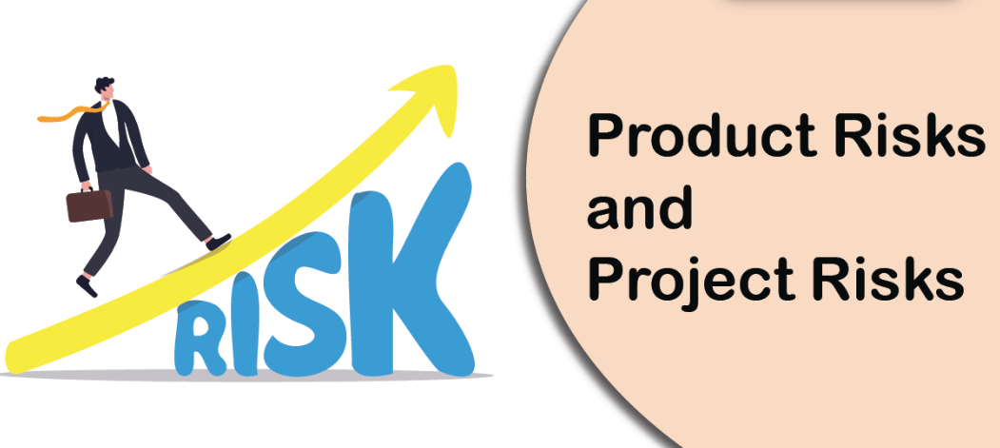

## 5.5.1 - **Definition of Risk**

Risk involves the possibility of an event in the future which has negative consequences. The level of risk
is determined by the likelihood of the event and the impact (the harm) from that event.
___
## 5.5.2 - **Product and Project Risks**

### **Product risks**

* Product risk involves the possibility that a work product (e.g., a specification, component, system, or test)
may fail to satisfy the legitimate needs of its users and/or stakeholders. 

* When the product risks are associated with specific quality characteristics of a product (e.g., functional suitability, reliability, performance efficiency, usability, security, compatibility, maintainability, and portability), product risks are
also called quality risks.

### **Examples:**

- [x] Software might not perform its intended functions according to the specification
- [x] Software might not perform its intended functions according to user, customer or stakeholder
needs
- [x] A system architecture may not adequately support some non-functional requirement(s)
- [x] A particular computation may be performed incorrectly in some circumstances
- [x] A loop control structure may be coded incorrectly
### **Project risks:**

Involves situations that, should they occur, may have a negative effect on a project's ability to
achieve its objectives.

### **Examples:**

- **Project issues:**
  
    - Delays in delivery
    - Inadequate or estimated funding $

- **Organizational issues:** 
  
    - Skills, training and staff may not be sufficient
    - Personal issues

- **Political issues:** 
  
    - Developers and/or testers may fail to follow up on information found in testing and
reviews
    - Conflicts between the team

- **Technical issues:** 
  
    - Requirements may not be defined well enough
    - Poor defect management 
    - No test environment
___
## 5.5.3 - **Risk-based testing and Product Quality**

Risk is used to focus the effort required during testing. It is used to decide where and when to start testing
and to identify areas that need more attention.

* A risk-based approach to testing provides proactive opportunities to reduce the levels of product risk.
    * The resulting product risk information is used to guide test planning, the
specification, preparation and execution of test cases, and test monitoring and control.

### **The results of product risk analysis are used to:**

- [x] Determine the test techniques to be employed
- [x] Determine the particular levels and types of testing to be performed (e.g., security testing,
accessibility testing)
- [x] Prioritize testing in an attempt to find the critical defects as early as possible

### **Risk management activities provide a disciplined approach to:**

- [x] Analyze (and re-evaluate on a regular basis) what can go wrong (risks)
- [x] Determine which risks are important to deal with
- [x] Implement actions to mitigate those risks
- [x] Make contingency plans to deal with the risks should they become actual events