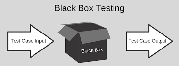
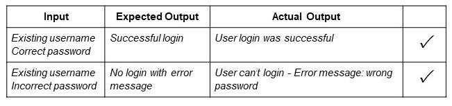
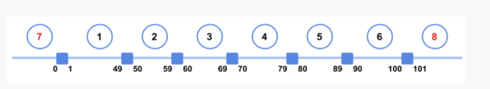
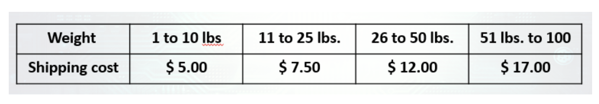
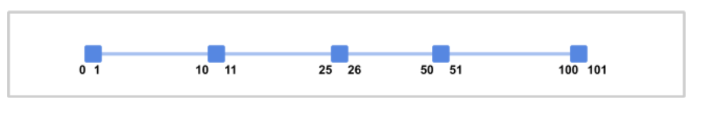
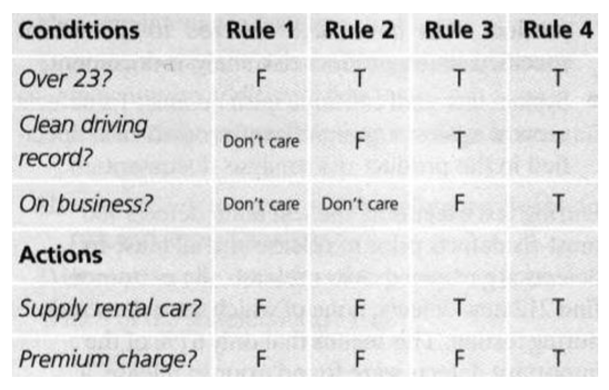
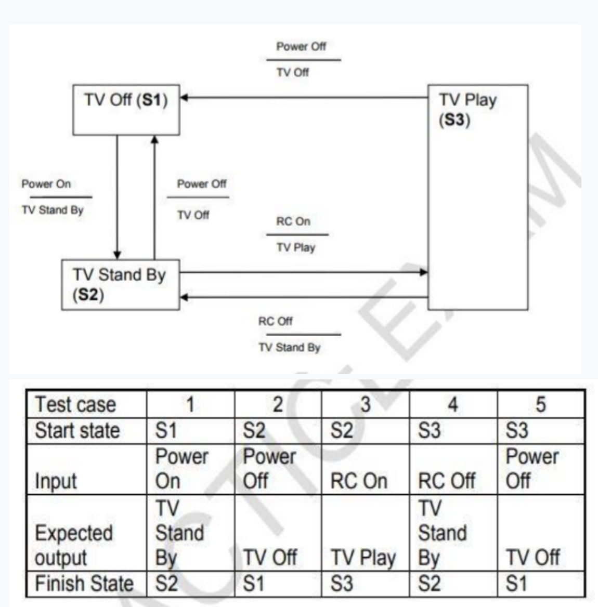
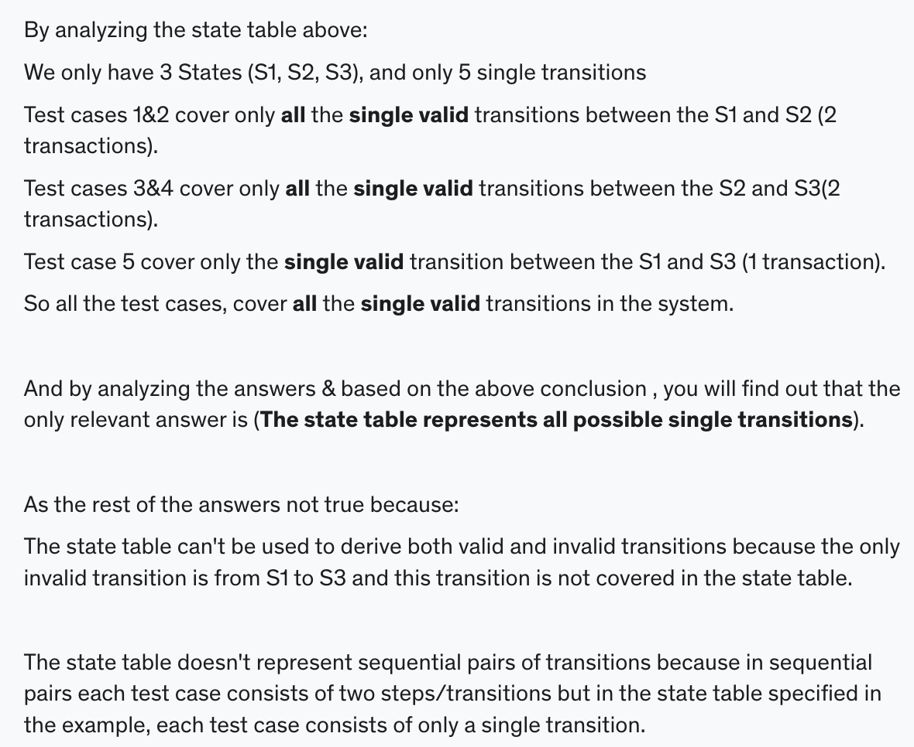

### **Example**:

## **Introduction:**

Black-Box Testing, which is also known as specification-based testing, analyses the functionality of a software/application without knowing much about the internal structure/design of the item. 

The purpose of this method is to check the functionality of the system as a whole to make sure that it works correctly and meets user demands.
___

# **Test Techniques**
## 4.2.1 - **Equivalence Partitioning**

### **Definition:**

In equivalence partitioning, input values to the system or application are divided into different partitions/group based on its similarity in the outcome. 

So instead of using each and every input value, you can use a value from each partition/group which covers all possible scenarios, to execute test cases.

### **Test Scenario**

Let’s suppose you are testing a machine that scores exam papers and assigns grades. Based on the score achieved the grades are as follows:

        1-49 = F, 50-59 = D-, 60-69 = D, 70-79 = C, 80-89 = B, 90-100=A

**If you apply equivalence partitioning, how many test cases will you need to  achieve minimum test coverage?**

### **Explanation** 

From the example we can draw the following “Number Line” where we will find out that we have 6 Valid Partitions [From 1 to 6 ] and 2 Invalid Partitions [7 & 8 ], so in total we have **"8 Partitions".**

- [x] correct answer: **8**
___
___

## 4.2.2 - **Boundary Value Analysis**

### **Definition:** 

If the input is within the boundary value, it is considered *‘Positive testing.’* 
If the input is outside of the boundary value, it is considered *‘Negative testing.’* It includes maximum, minimum, inside or outside edge, typical values or error values.

### **Test Scenario**

You are testing a scale system that determines shipping rates for a regional web-based auto parts distributor. Due to regulations, shipments cannot exceed 100 lbs. You want to include boundary value analysis as part of your black-box test design.

**How many tests will you need to execute to achieve 100% boundary value analysis?**
### **Example** 

**explanation:**

From the example we can draw the following “Number Line”, where we will find out that we have 8 Valid Boundaries [ 1,10, 11,25, 26,50, 51,100 ]  and 2 Invalid Boundaries [ 0 , 101 ] so in total we have "10 Boundaries".

- [x] correct answer: **10**

From the example we can draw the following “Number Line”, where we will find out that we have 8 Valid Boundaries [ 1,10, 11,25, 26,50, 51,100 ]  and 2 Invalid Boundaries [ 0 , 101 ] so in total we have "10 Boundaries".
___
___
## 4.2.3 - **Decision Table Testing**

### **Definition:** 

A Decision Table basically is a tabular representation of different possible **conditions** ---> *(inputs)* versus **test actions** ---> *outputs*. 

In this technique, we deal with a different combination of input values. 

This helps tester identify all input values if he has overlooked any. Hence its also referred to as a cause-effect table technique. 

### **Test Scenario**

Given this decision table, what is the expected result for the following test cases?

1. **TCI:** A 26-year-old on business but with violations or accidents on his driving record

2. **TC2:** A 62-year-old tourist with a clean driving record

### **Example** 

**Explanation:**

- [x] **correct answer:** **TCI:** Don't supply car with premium charge; **TC2:** Supply car with no premium charge

By analyzing the two given test cases and the table you will find out that :

Test case (1) test the Rule number (2) which means that the expected result from this test case is to (Don’t Supply car “with no premium charge”).

Test case (2) test the Rule number (3) which means that the expected result from this test case is to (Supply car with no premium charge).

Based on this, you will find out that the only relevant answer is (TC1:Don’t Supply car ,TC2:Supply car with no premium charge ).
___
___

## 4.2.4 - **State Transition Testing**

### **Definition**

In this approach, the tester analyzes the behavior of an application under test for different input conditions in a sequence. You can provide positive as well as negative values to check how the application responds. 

You can apply this technique when an application/system gives a different output for the same input, depending on what has happened in the earlier state. We call such a system as a finite state system.
### **Test Scenario**

Which of the following statements about the given state table is TRUE?

### **Explanation** 

- [x] **Correct answer:** The state table represents all possible single transitions.

___
___

## 4.2.5 - **Use Case Testing**

### **Definition:** 

It depends on **‘User Actions’** and **‘Response of System’** to those User Actions. This technique is completely functional testing technique, as in no programming skill is required. You can follow these three simple steps to perform use case testing:

1. Identify all the possible scenarios from a Use Case
2. For each scenario, define a test case and a condition for that test case to be executed
3. For each scenario, determine the test data for the test

### **Test Scenario**

### **Explanation** 