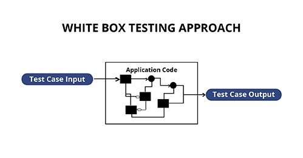
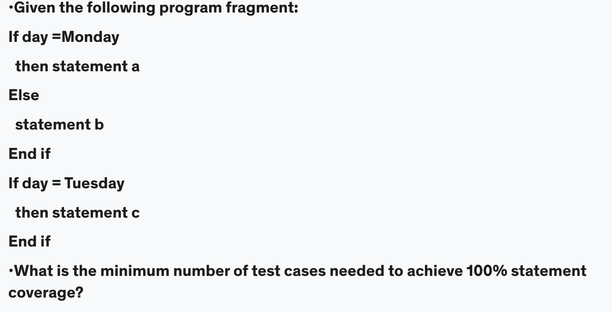
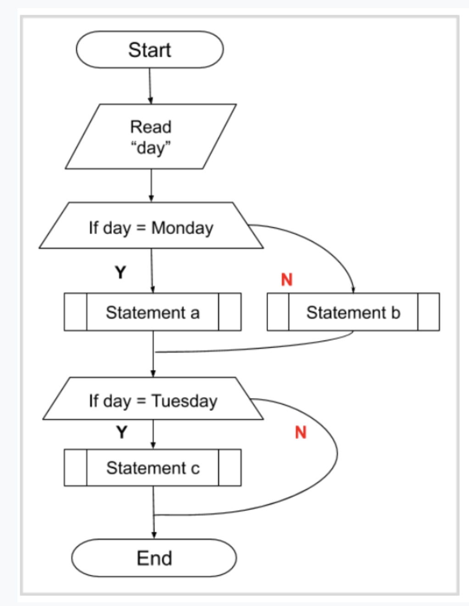

## **Definition:**

is a testing technique which evaluates the **code** and the **internal structure** of a program.

When you know the internal structure of a product, tests can be conducted to ensure that the internal operations performed according to the specification. And all internal components have been adequately exercised.

___
___
# **Test Techniques**
## 4.3.1 - **Statement Testing and coverage**

### **Definition:**

*“Statement Coverage”*, as the name itself suggests, it is the method of validating whether each and every line of the code is executed at least once

### **Test Scenario:**

### **Explanation**

*Based on the above image:*

To make a 100% Statement Coverage you need to trigger the statements
[Statement a ,Statement b, Statement c ]

*For Statement Coverage:*

Since you can’t trigger the three statements with a single execution, the minimum test cases required to cover all the possible sequences of statements are 2 test cases.

1. **TC1 :** day = Monday, will trigger the (Statement a )

2. **TC2 :** day = Tuesday, will trigger the (Statement b ,Statement c )

So the minimum test cases required to cover all the possible sequences of statements are **2 test cases.**

___
## 4.3.2 - **Decision Testing and coverage** 

### **Definition:**

The Decision Coverage Testing is expected to be implemented on every single one line of the program, and identify the possible decision making stream in the codes

Decision Coverage % = ((Number of decision products implemented) / (Total number of decision products) * 100)
### **Test Scenario:**

### **Example**

## **Explanation**

Minimum Tests required for statement coverage and branch coverage

___
___
## 4.2.4 - **The value of Statement and Decision Testing**

### **Defintiion:**

### **Test Scenario:**

### **Example**

___