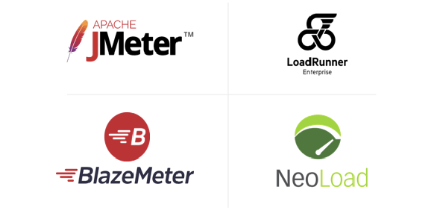
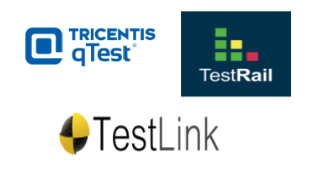

## 6.1.1 - **Test Tool Classification**

Tools are classified according to the testing activities that they support but those that support more than one activity are classified in the most closely associated.

### **Tool support for management of testing and testware**

#### **Example of tools:** 

### **Tool support for static testing**

Static testing tools are associated with the activities related to analyse the code withouw executing it.
#### **Example of tools:** 

___

### **Tool support for test design and implementation**

Include test cases, test procedures and test data.
#### **Example of tools:** 

- [x] Model-Based testing tools
- [x] Test data preparation tools

In some cases, tools that support test design and implementation may also support test execution and
logging, or provide their outputs directly to other tools that support test execution and logging
### **Tool support for test execution and logging**

#### **Example of tools:** 

- [x] Test execution tools (e.g., to run regression tests)
- [x] Coverage tools (e.g., requirements coverage, code coverage (D))
- [x] Test harnesses (D)
### **Tool support for Performance measurement and Dynamic analysis**

Are ‘dynamic’ because they require the code to be in a running state
#### **Example of tools:** 

- [x] Performance testing tools
- [x] Dynamic analysis tools (D)

___
## 6.1.2 - **Benefits and Risks of Test Automation**

Simply acquiring a tool does not guarantee success. Each new tool introduced into an organization will require effort to achieve real and lasting benefits. 

**Potential benefits of using tools to support test execution include:**

1. Reduction in repetitive manual work *(e.g., running regression tests, environment set up/tear down
tasks, re-entering the same test data, and checking against coding standards)*
2. Greater consistency and repeatability
3. More objective assessment (e.g., static measures, coverage) 
4. Easier access to information about testing (e.g., statistics and graphs about test progress, defect
rates and performance)

**Potential risks of using tools to support test execution include:**

1. The time and effort needed to achieve significant and continuing benefits from the tool may be
under-estimated 
2. A new platform or technology may not be supported by the tool
3. The effort required to maintain the test work products generated by the tool may be underestimated
4. Expectations for the tool may be unrealistic.

___
## 6.1.3 - **Special Considerations for Test Execution and Test Management Tools**

### **Test Execution tools:**

- [x] Capturing test approach
- [x] Data-driven test approach:
- [x] Keyword-driven test approach: 
### **Test Management tools**

**Are useful for:**

* Fits the needs of the organization
* To maintain consistent traceability to requirements in a requirements management tool
* To link with test object version information

