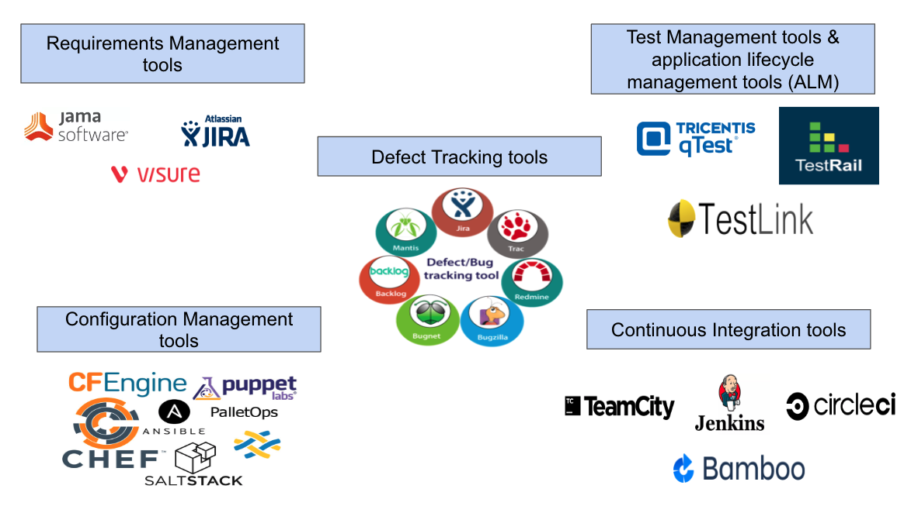
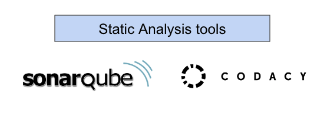

## 6.1.1 - **Test Tool Classification**

Tools are classified according to the testing activities that they support but those that support more than one activity are classified in the most closely associated.

### Tool support for management of testing and testware

### Tool support for static testing

### Tool support for test execution and logging

### Tool support for Performance measurement and Dynamic analysis

___
## 6.1.2 - **Benefits and Risks of Test Automation**

___
## 6.1.3 - **Special Considerations for Test Execution and Test Management Tools**
